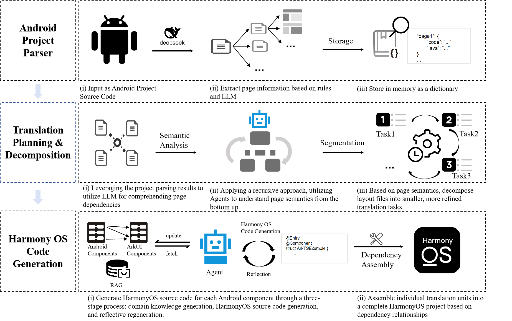

# UITrans: Seamless UI Translation from Android to HarmonyOS
Seamless user interface (i.e., UI) translation has emerged as a pivotal technique for modern mobile developers, addressing the challenge of developing separate UI applications for Android and HarmonyOS platforms due to fundamental differences in layout structures and development paradigms. In this paper, we present UITrans, the first automated UI translation tool designed for Android to HarmonyOS. UITrans leverages an LLM-driven multi-agent reflective collaboration framework to convert Android XML layouts into HarmonyOS ArkUI layouts. It not only maps component-level and page-level elements to ArkUI equivalents but also handles project-level challenges, including complex layouts and interaction logic. Our evaluation of six Android applications demonstrates that our UITrans achieves translation success rates of over 90.1\%, 89.3\%, and 89.2\% at the component, page, and project levels, respectively. UITrans is available at https://github.com/OpenSELab/UITrans and the demo video can be viewed at https://www.youtube.com/watch?v=iqKOSmCnJG0.

# Our Approach

UITrans takes the source code of Android project as input and the source code of HarmonyOS as output. The core of UITrans relies on a multi-agent reflective collaboration mechanism, powered by a large language model, to parse Android components, convert them into intermediate functional representations, and ultimately generate HarmonyOS code.
1. Android Project Parsing: is responsible for analyzing the logical structure of the application, including both pages and subpages, to prepare the application for the migration process (see Section 2.1 for details).
2. Translation Task Planning and Decomposition: employs systematic decomposition rules to identify and isolate the smallest translatable units, allowing for an organized and efficient translation strategy (see Section 2.2).

